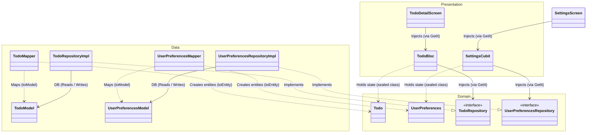
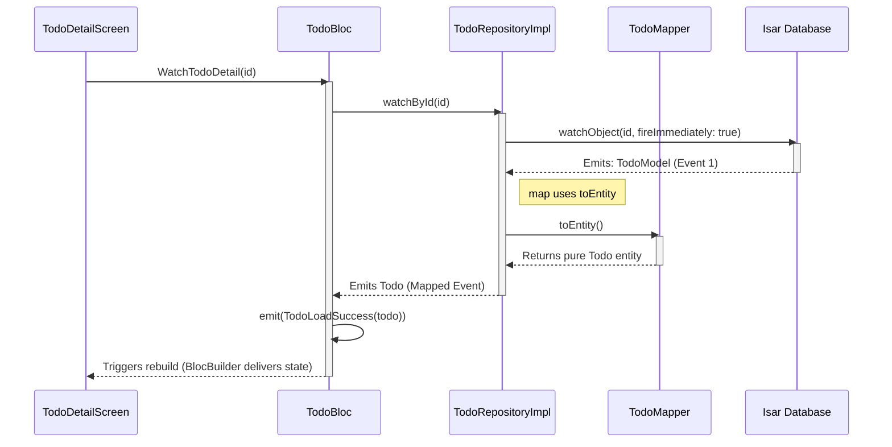

# 🚀 Flutter Local-First Blueprint — BLoC + GetIt + Injectable + Isar Clean Architecture

A production-grade reference architecture and starter blueprint for Flutter applications, engineered for offline resilience, predictable state boundaries, and lean scalability.

> **Note:** While distributed as an advanced starter boilerplate to remain easily discoverable for developers, this repository is fully documented and structured as a comprehensive Reference Architecture.

## 🎯 Philosophy: Why This Blueprint Exists

Most Flutter boilerplates suffer from "kitchen-sink syndrome" — they inject dozens of third-party packages "just in case," forcing your project into unnecessary architectural debt from day one.

This Blueprint is built on a different conviction: **maximal architectural control through deliberate minimalism.** It is tailored specifically for **Local-First** applications to achieve:
- **Reduced Infrastructure Dependency**: Designed to minimize reliance on backend infrastructure and optimize client-side resources.
- **Offline-First Predictability**: Complete data reliability even in complete network dead-zones.
- **High Testability**: A codebase where business logic is entirely decoupled from the UI, enabling predictable visual and unit regression testing.
- **Lean Engineering**: Leveraging native language features instead of relying on heavy code-generation wrappers wherever possible.

## ✨ Key Features

This application serves as a full-fledged testing ground for the implemented patterns. It includes:
- **Full CRUD** for tasks (Todo).
- **Todo List**: A reactive list with checkboxes and Swipe-to-delete functionality.
- **Todo Detail Screen**: A standalone, independent view that fetches a specific resource by ID, protecting the application against memory leaks by leveraging constructor injection, explicit event-driven resource fetching, and native resource deallocation when the `BlocProvider` is popped from the widget tree.
- **Settings Module**: Implementation of a global configuration layer (`ThemeMode`) backed by an Isar database singleton collection (`id=0`), reactively bound to the root `MaterialApp` via a `Cubit`.
- **Testability**: A comprehensive suite of unit tests (BLoC/Cubit) and UI tests (Widget Tests).
- **Visual Regression (Screenshot Testing)**: Implementation of Golden Tests to ensure pixel-perfect stability across the app UI.

## 🛠 Tech Stack

- **Framework**: [Flutter](https://flutter.dev/)
- **State Management**: [BLoC / Cubit](https://bloclibrary.dev/) (via `flutter_bloc`)
- **Dependency Injection & Service Locator**: [GetIt](https://pub.dev/packages/get_it) & [Injectable](https://pub.dev/packages/injectable) (powered by `build_runner` code generation)
- **Database**: [Isar Community](https://pub.dev/packages/isar_community) (type-safe, reactive streams)
- **Architecture**: Clean Architecture (Feature-First)
- **Testing**: `flutter_test`, `mocktail` (for repository mocking), `bloc_test` (for BLoC unit testing)
- **Misc**: `dio` (for future network sync module), `intl` for elegant date formatting (e.g., on the details screen).

## 📐 Design Principles

- **Feature-First Organization**: Keeps the codebase modular and self-contained as the application grows.
- **Local-First by Default**: The local database dictates the application state, ensuring 100% offline resilience.
- **Dependency Inversion**: Strict compilation boundaries where Data and Presentation layers depend on the pure Domain core.
- **Single Source of Truth**: UI components subscribe directly to reactive database streams via targeted identifiers.
- **Minimal Dependencies**: Leveraging native Dart 3+ features (Records, Patterns, sealed classes) to minimize reliance on third-party macro layers.
- **Synchronous Mappers**: Complete isolation between database schemas and domain logic via stateless transformers.
- **Test-Driven Predictability**: Built to support deterministic unit, widget, and visual regression (Golden) testing.

---
## 🎯 Target Audience: When to Use This Blueprint

This blueprint is highly opinionated and tailored for specific architectural requirements.

| ✅ Ideal For | ❌ Not Designed For |
| :--- | :--- |
| • Offline-first & Local-First applications | • Backend-heavy dashboards with minimal local state |
| • Productivity, utility, and personal knowledge tools | • API-first applications that serve as thin clients |
| • Apps requiring instant persistence & reactive local UI streams | • Real-time collaborative multi-user document editors |
| • High-fidelity MVPs designed to validate local core logic | • Enterprise systems strictly tied to microservice clients |

## 🧠 Architectural Decisions

An architect is defined by what they choose *not* to include. Below is the technical rationale behind selecting native patterns over several industry-standard packages in this blueprint:

| Package | Why it was omitted |
| :--- |:--- |
| **Dio / Retrofit** | This is a **Local-First** architecture. The local database (Isar) is the single source of truth. Network layers belong in specific synchronization feature-modules, not as a core global dependency of a local starter. Dio is registered as an optional GetIt singleton for future sync module development. |
| **Freezed / Equatable** | Native Dart 3+ features (Records, Pattern Matching, and sealed Class Modifiers) significantly reduce the need for additional code-generation layers to achieve data immutability and deep comparison in standard use cases. |
| **Riverpod** | BLoC provides explicit, event-driven state management with a unidirectional data flow that is easier to reason about in complex Local-First scenarios. Combined with GetIt for dependency injection, the architecture avoids the implicit provider graph and widget-ref-scaffolding of Riverpod, resulting in more testable and debuggable code. |
| **GoRouter / AutoRoute** | Navigation requirements vary drastically between simple apps and complex multi-module systems. This blueprint leaves navigation unopinionated, allowing you to use pure Flutter Navigator or drop in your preferred routing layer seamlessly. |
| **Hive / Drift** | Isar (Community) was chosen for its native multi-platform speed, type-safe query links, and powerful watch streams, which integrate flawlessly with BLoC/Cubit reactive pipelines. |

## 📂 Project Structure (Feature-First)

The project is thematically divided by features. Each feature contains three independent layers with strictly defined dependency directions (Data & Presentation -> Domain).

```text
lib/
├── main.dart                    # Entry point (configureDependencies + runApp)
├── app.dart                     # MaterialApp + MultiBlocProvider
├── core/
│   ├── database/                # Isar database module (@module, @preResolve)
│   │   └── database_module.dart
│   ├── di/                      # Dependency injection setup (GetIt + Injectable)
│   │   ├── injection.dart       # @InjectableInit
│   │   └── injection.config.dart # Generated (build_runner)
│   ├── errors/                  # Failure sealed hierarchy
│   │   └── failure.dart
│   └── network/                 # Optional Dio network module (@module)
│       └── network_module.dart
└── features/
    ├── todos/
    │   ├── domain/              # 1. DOMAIN LAYER (Independent)
    │   │   ├── entities/        # -> todo.dart
    │   │   └── repositories/    # -> todo_repository.dart (interface)
    │   ├── data/                # 2. DATA LAYER (Dependent on external APIs/DBs)
    │   │   ├── models/          # -> todo_model.dart (Isar @collection)
    │   │   ├── mappers/         # -> todo_mapper.dart
    │   │   └── repositories/    # -> todo_repository_impl.dart (Implementation)
    │   └── presentation/        # 3. PRESENTATION LAYER (UI + State Management)
    │       ├── bloc/            # -> todo_bloc.dart, todo_event.dart, todo_state.dart
    │       ├── screens/         # -> todo_screen.dart, todo_screen_detail.dart
    │       ├── shared/          # -> format.dart
    │       └── widgets/         # -> todo_list_item.dart, add_todo_fab.dart
    └── settings/
        ├── domain/              # -> user_preferences.dart + repository contract
        ├── data/                # -> Isar singleton model (id=0), mapper, repository
        └── presentation/        # -> cubit/settings_cubit.dart, screens/settings_screen.dart
```

---

## 🏗 Architectural Overview

This blueprint places maximum emphasis on Dependency Inversion and the predictability of behaviors during asynchronous I/O operations.

### Layer Separation (Class Diagram)

The lines indicate strict dependency directions. The Data and Presentation layers point towards the center (Domain), meaning database models can be swapped without affecting the business core.



### Reactivity and Single Source of Truth (Sequence Diagram)

Passing only the `ID` from the view and subscribing to the stream via a BLoC event guarantees a **Single Source of Truth** – the database (Isar) decides what state the screen should be in at any given moment. Mappers do not handle asynchronous queries; all I/O isolation logic resides entirely in the Repository's helper method.



### 🧠 Key Architectural Concepts:

1. **I/O Isolation Pattern**: Mappers (e.g., `TodoMapper`), following best practices, remain fully **synchronous, stateless functions (extensions)**. The mapper never executes I/O operations.
2. **Single Source of Truth via ID**: Layers exchange only the simplest identifiers (Int/String). Every new screen, component, or dialog fetches the latest data structure independently. This eliminates the risk of passing outdated snapshots through navigation parameters.
3. **Constructor Injection & Resource Deallocation**: BLoCs and Cubits receive their repository dependencies via constructor injection (managed by GetIt/Injectable). When a screen is popped from the widget tree, the corresponding `BlocProvider` is disposed, and the BLoC's `close()` method cancels the Isar stream subscription, thereby conserving RAM and preventing memory leaks.

---

## 🚀 Setup and Development

The `injectable` library works alongside `isar_community_generator` under a shared `build_runner` pipeline.

```bash
# Install dependencies
flutter pub get

# Generate files (.g.dart for Injectable DI graph, Isar schemas)
dart run build_runner build --delete-conflicting-outputs

# Run on the selected device
flutter run
```

## 🧪 Verification

All core concepts are covered by comprehensive tests that verify behavior during asynchronous operations and BLoC's lifecycle.

```bash
# Linter (Code Analysis)
flutter analyze

# Run the full test suite
flutter test
```

- **BLoC/Cubit Tests (Unit)**: Validate loading / success / failure states, intercept CRUD logic, confirm stream subscription cancellation, and verify undo behavior. Powered by `bloc_test` and `mocktail`.
- **Widget Tests (UI)**: Dedicated, simulated resources using `async*` events are injected into the widgets to faithfully replicate the database's delay cycle (fixing potential `pumpAndSettle` pitfalls).
- **Golden Tests**: Verifies UI components pixel-by-pixel for Todo empty/populated states and the Settings screen, freezing viewport size, theme-related inputs, and deterministic fixture data.

## 🗺️ Roadmap

- [x] BLoC + Cubit state management with `flutter_bloc`
- [x] GetIt & Injectable compile-time dependency injection
- [x] Isar Community database integration with reactive streams
- [x] Strict I/O Isolation Pattern via Synchronous Mappers
- [x] Comprehensive Test Suite (Unit, Widget, and Golden Tests)
- [x] Production-ready GitHub Actions CI/CD Pipeline
- [ ] Multi-language Localization (intl wrapper enhancement)
- [ ] Reference Network Sync Module (Edge-to-Cloud sync draft)
- [ ] CLI Feature Template Generator for faster scaffolding
